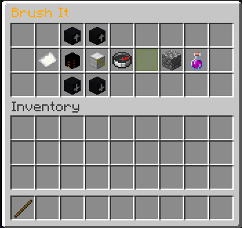
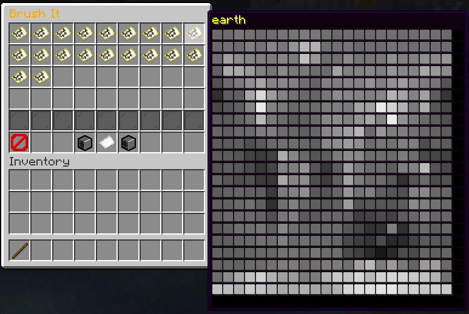

### Description
* Brush It is a tool containing different features to change landscape and nature.
### Configuration
Add in the list `features` in the section `volans` the string `"BrushIt"`.
### Permissions
See [here](/docs/Permissions/#brushit)
### Utilisation
1. With the setup item (default stick), left-click in the air.
2. You will see the menu on the first picture of this documentation. Hover over the items (for example the paper) to get more information.
3. If you right-click on the paper item, you can enable/disable the brush
4. Left click allows you to open a different menu to select a different heightmap to brush. Another left click changes the brush to the selected heightmap.
5. If you clicked on the heightmap, the menu is closed, you can reopen the main menu with left-click in the air again
6. There are multiple parameters to change next to the paper item. Hover on each one to see what is possible.
7. Changing intensity will change how tall the mountain will be. The higher the number the taller the mountain.
8. The 3D Mode is more for building organics and can take much longer to set.
9. The addition mode is for adding a mountain or when clicked, creating a matching hole depending on the other parameters and the selected heightmap brush.
### Pictures

### Videos
- None at the moment