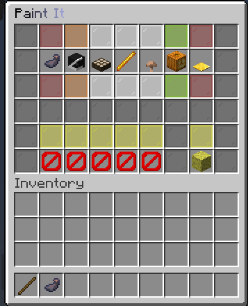
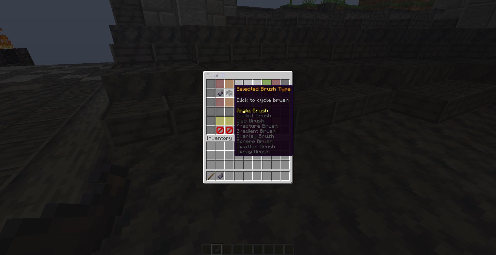
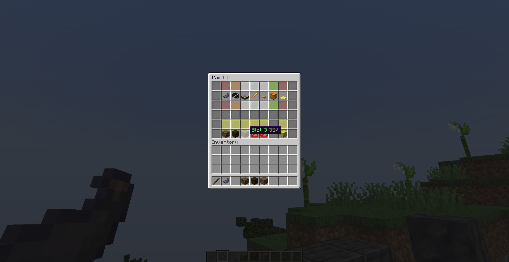

### Description
* PaintIt is a brush tool allowing "painting" with blocks
### Configuration
Add in the list `features` in the section `volans` the string `"PaintIt"`.
### Permissions
See [here](/docs/Permissions/#paintit)
### Utilisation
1. Left click with the ink sac item to open the PaintIt main menu.
2. Hover over each item to see features and parameters to set / change.
3. It's a little bit different from BrushIt, to use the brush, click on the ink sac item in the menu to activate it.
4. To change the brush, click on the second item (head) in the row to cycle through different brushes.
5. Add blocks from your creative inventory when you drag the item into the barrier block slot. You can add up to 5 different blocks.
6. The slot with the sponge can be filled with a block you want to change (it's the block for mask).
7. Also make sure you enabled mask mode.
### Pictures

### Videos
- None at the moment